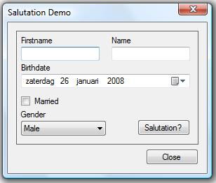

# Using Rules outside of a Workflow

## Introduction

These last few weeks I have been reading [Bruce Bukovics' book](https://link.springer.com/book/10.1007/978-1-4302-0976-8) about the Windows Workflow Foundation. If you are new to workflows I recommend getting this book. It discusses developing workflows in great length and contains many examples along the way. It is fun to read, isn't too verbose and the code examples really help you get up to speed on the WF Foundation.

This article assumes that you already have a working knowlegde about workflows and in particular about using rules. Working with rules is one of the most interesting parts of the WF foundation. They offer you the ability to extract business logic from the workflow or activities (standard or custom). You can opt to put certain logic into one or more rules and group these rules into a set. Defining rules can be done with normal procedural code, but is usually done by using declarative conditions. Sets of rules are saved in a .rules file in Xml format. The sets you define are later evaluated and executed for you by the rules engine.

While these rule sets are normally part of a workflow, you can use this mechanism in other types of projects without having to compose a workflow in which these sets are contained. You can put the rules engine to use in a normal Windows Forms application for example and apply a set of rules against one of your custom type of objects. This allows you to seperate certain business logic from a class into rules. Since these rules are stored in a .rules file which you can store in a resource manager (assembly, database...etc.) of your choose this gives you the ability to changes the rules without the need to recompile your application. Pretty handy when your customer decides to change the business requirements.

This article demonstrates how to apply rules against a custom object in a normal Windows Forms application without the need to include a workflow. So let's get started...

## Your Development Environment

Welcome to the shortest section in this article. In order to develop applications using workflow rules, you'll need a minimum set of software components. The minimum requirements are the following:

- Visual Studio 2005 / 2008 (Enterprise, Professional or Standard)
- .NET Framework version 3.0 or 3.5

The Workflow Foundation is part of the .NET Framework since version 3.0 (formerly known as WinFX).

## The Business Logic

The first thing you need for the example application is a problem to which you can apply some logic to solve it. Imagine that you are developing an application which prints out greeting cards. On each card you obviously print out the person's first -and lastname, but each name is preceded by a salutation such as "Mr", "Mrs",... . Depending on the person's age, martial state and gender this salutation can differ.

Let's use the following list of possible salutations:

<table border="0" width="192"><tbody><tr><td align="left"><strong>Married</strong></td><td><strong>Male</strong></td><td><strong>Female</strong></td></tr><tr><td>Yes</td><td>Mr</td><td>Mrs</td></tr><tr><td>No</td><td>Mr</td><td>Miss</td></tr></tbody></table>

The above list applies to adults only, for minors the saluation "To the parents of" will be used instead. The business logic to determine the correct salutation based on a person's age, martial state and gender will be contained in a rule set which you'll apply to a custom object. In real life you would ofcourse encounter much more difficult, elaborate scenarios, but for this example this is sufficient.

## Implementing The Person Class

The application to test the rules will be a Windows Forms application. C# will be used as the programming language of choice. Startup Visual Studio and create a new blank solution and name it RuleSetSolution.

To begin development of this example, create a new Class Library project called SharedClassLibrary and add it to the solution. You can delete the Class1.cs file from this project. The first order of business is to implement a class that defines the person for which the salutation has to be determined. The rule set will be applied against an instance of this class. The rules in the set will examine certain properties of this class and based on their values will choose and set the correct salutation.

Add a C# class to the SharedClassLibrary project and name it Person. Listing 1 shows the complete code for the Person.cs file.

**Listing 1** - Complete Person.cs File

```csharp
using System;
using System.Collections.Generic;
using System.Linq;
using System.Text;

namespace SharedClassLibrary
{
    /// <summary>
    /// A class that defines a person
    /// </summary>
    public class Person
    {
        #region Private instance variables

        private String name;
        private String firstname;
        private DateTime birthDate;
        private String gender;
        private Boolean married;
        private String salutation;

        #endregion

        #region Private methods

        /// <summary>
        /// Calculates the age of the person.
        /// </summary>
        /// <returns></returns>
        private Int32 CalculateAge()
        {
            //Store today's date
            DateTime now = DateTime.Today;
            //Calculate the difference in years
            Int32 years = now.Year - birthDate.Year;
            //Subtract one year, if the current date is
            //before the birthday
            if ((now.Month < birthDate.Month) ||
                (now.Month == birthDate.Month &&
                now.Day < birthDate.Day))
            {
                years--;
            }
            return years;
        }

        #endregion

        #region Public properties

        public String Name
        {
            get { return name; }
            set { name = value; }
        }

        public String Firstname
        {
            get { return firstname; }
            set { firstname = value; }
        }

        public DateTime BirthDate
        {
            get { return birthDate; }
            set { birthDate = value; }
        }

        public String Gender
        {
            get { return gender; }
            set { gender = value; }
        }

        public Boolean Married
        {
            get { return married; }
            set { married = value; }
        }

        /// <summary>
        /// Readonly property which returns the
        /// age of the person
        /// </summary>
        public Int32 Age
        {
            get { return CalculateAge(); }
        }

        /// <summary>
        /// Readonly property that returns true
        /// if the person is a minor
        /// </summary>
        public Boolean Minor
        {
            get { return (Age < 18); }
        }

        /// <summary>
        /// Readonly property that returns true
        /// if the person is an adult
        /// </summary>
        public Boolean Adult
        {
            get { return (Age >= 18); }
        }

        public String Salutation
        {
            get { return salutation; }
            set { salutation = value; }
        }

        #endregion
    }
}
```

This class contains a few instance variables such as name, firstname, birthdate, gender, married and salutation. Each of these variables is exposed through a property. A couple of extra readonly properties Age, Adult and Minor are also provided. These return some extra information about the person based on the data contained in the previously mentioned instance variables. You will use these properties later on when defining the rules.

As you can see this class does not contain any business logic to determine the value of the salutation property. If you do not set the value yourself it will remain empty. Normally you would add some logic in the get accessor of this property in order to return the correct salutation. The next section discusses how this logic can be implemented in a rule set instead of being encapsulated by this class.

## Declaring The Rules

At first the rule set will be declared with the use of a workflow, later on in the article you will see how you can circumvent this. Now add a new empty worklflow project to the RuleSetSolution solution and name it SharedRuleSets. Be sure to add a reference to the SharedClassLibrary project. Next add a new sequential workflow to the SharedRuleSets projects and name it RuleSetWorkflow.

Before you move to the visual design of the workflow, you need to add a property that allows the rule set editor to access the properties of the Person class. The code for the RuleSetWorkflow is shown in Listing 2.

**Listing 2** - Complete RuleSetWorkflow.cs File

```csharp
using System;
using System.ComponentModel;
using System.ComponentModel.Design;
using System.Collections;
using System.Drawing;
using System.Linq;
using System.Workflow.ComponentModel.Compiler;
using System.Workflow.ComponentModel.Serialization;
using System.Workflow.ComponentModel;
using System.Workflow.ComponentModel.Design;
using System.Workflow.Runtime;
using System.Workflow.Activities;
using System.Workflow.Activities.Rules;

using SharedClassLibrary;

namespace SharedRuleSets
{
    public sealed partial class RuleSetWorkflow: SequentialWorkflowActivity
    {
        private Person person;

        public Person Person
        {
            get { return person; }
            set { person = value; }
        }

        public RuleSetWorkflow()
        {
            InitializeComponent();
        }
    }
}
```

After switching back to the workflow designer view, drag and drop a PolicyActivity onto the empty workflow. You can now define a rule set for the PolicyActivity, the rule set editor will allow you to access the properties found in the workflow. This includes the Person object. The workflow is passed in the rule set dialog's constructor so that it knows what kind of object it is working upon. This rule set includes three simple rules, the first rule is listed in Table 1.

**Table1** - IsMinor Rule Definition

<table border="0"><tbody><tr><td width="100"><strong>Property</strong></td><td><strong>Value</strong></td></tr><tr><td>Name</td><td>IsMinor</td></tr><tr><td>Priority</td><td>10</td></tr><tr><td>Reevalution</td><td>Always (default)</td></tr><tr><td>Condition</td><td>this.Person.Minor</td></tr><tr><td>Then Action</td><td>this.Person.Salutation = "To the parents of " + this.Person.Name + " " + this.Person.Firstname</td></tr><tr><td>Else Action</td><td>/</td></tr></tbody></table>

This rule checks if the person is a minor and if so sets the salutation to "The parents of" followed by the last -and firstname of the person.

**Table2** - IsMale Rule Definition

<table border="0"><tbody><tr><td width="100"><strong>Property</strong></td><td><strong>Value</strong></td></tr><tr><td>Name</td><td>IsMale</td></tr><tr><td>Priority</td><td>30</td></tr><tr><td>Reevalution</td><td>Always (default)</td></tr><tr><td>Condition</td><td>this.Person.Gender == "Male"</td></tr><tr><td>Then Action</td><td>this.Person.Salutation = "Mr " + this.Person.Name + " " + this.Person.Firstname</td></tr><tr><td>Else Action</td><td>this.Person.Salutation = "Miss " + this.Person.Name + " " + this.Person.Firstname</td></tr></tbody></table>

The second rule checks if the person is a male and if that's the case the person's last -and firstname will be preceded with "Mr", if not than "Miss" will be the prefix.

**Table3** - IsMarriedFemale Rule Definition

<table border="0"><tbody><tr><td width="100"><strong>Property</strong></td><td><strong>Value</strong></td></tr><tr><td>Name</td><td>IsMarriedFemale</td></tr><tr><td>Priority</td><td>20</td></tr><tr><td>Reevalution</td><td>Always (default)</td></tr><tr><td>Condition</td><td>this.Person.Gender == "Female" &amp;&amp; this.Person.Married</td></tr><tr><td>Then Action</td><td>this.Person.Salutation = "Mrs " + this.Person.Name + " " + this.Person.Firstname</td></tr><tr><td>Else Action</td><td>/</td></tr></tbody></table>

The last rule checks if the person is married and of the female variety and if so will attribute a prefix of "Mrs" to the salutation.

Thanks to the priority of each rule the rule engine will execute them in the following order:

1. IsMale
2. IsMarriedFemale
3. IsMinor

Set the chaining of the rule set to Sequential and save it. As a last step rename the rule set to DetermineSalutation. Now this isn't the most elegant rule set, but the point of this article is not how to compose rule sets, but how to use them outside of a workflow.

## Applying The Rules

Now that you have defined the business logic to determine the salutation prefix for a person it is time to apply this logic to the Person class. To do this you must load the rule set from the SharedRuleSets assembly. The rule set is stored in the RuleSetworkflow.rules file which is embedded in this project. Because this is pretty common code which you can reuse in other projects this is implemented as a static class in the SharedClassLibrary project. But first add the following references to the SharedClassLibrary project:

- System.Workflow.ComponentModel
- System.Workflow.Activities

Now add a new C# class to the SharedClassLibrary project and name it RuleSetManager. Listing 3 shows the entire code for this file.

**Listing 3** - Complete RuleSetManager.cs File

```csharp
using System;
using System.Collections.Generic;
using System.Linq;
using System.Text;
using System.Reflection;
using System.IO;
using System.Xml;
using System.Workflow.ComponentModel.Compiler;
using System.Workflow.ComponentModel.Serialization;
using System.Workflow.Activities.Rules;

namespace SharedClassLibrary
{
    public static class RuleSetManager
    {
        /// <summary>
        /// Load a .rules resource (= manifestResource) from an assembly and
        /// apply the specified RuleSet against an instance of a specified type
        /// of object.
        /// </summary>
        /// <param name="assembly"></param>
        /// <param name="manifestResource"></param>
        /// <param name="ruleSet"></param>
        /// <param name="objectType"></param>
        /// <param name="instance"></param>
        public static void ApplyRuleSet(Type assembly, String manifestResource,
            String ruleSet, Type objectType, Object instance)
        {
            //Load the embedded .rules resource (= manifestResource parameter)
            //from the specified assembly (= assembly parameter).
            Assembly assemblyResource = Assembly.GetAssembly(assembly);
            Stream stream = assemblyResource.GetManifestResourceStream(manifestResource);

            //The RuleSet is serialized and saved in Xml format.
            using (XmlReader xmlReader = XmlReader.Create(new StreamReader(stream)))
            {
                //Deserialize the Xml string. The result is a RuleDefinitions object.
                //The RuleDefinitions class is a container for the .rules file that
                //was just loaded. A .rules file can contain one or more RuleSets.
                WorkflowMarkupSerializer markupSerializer =
                    new WorkflowMarkupSerializer();
                RuleDefinitions ruleDefinitions =
                    markupSerializer.Deserialize(xmlReader) as RuleDefinitions;

                if (ruleDefinitions != null)
                {
                    //Extract the wanted RuleSet (= ruleSet parameter) from the
                    //RuleDefinitions object.
                    if (ruleDefinitions.RuleSets.Contains(ruleSet))
                    {
                        RuleSet rs = ruleDefinitions.RuleSets[ruleSet];

                        //Next check if the rules within the RuleSet can be a applied to
                        //the specified type of object.
                        RuleValidation validation = new RuleValidation(
                            objectType, null);

                        if (rs.Validate(validation))
                        {
                            //If the RuleSet is valid for the specified type of object, then
                            //execute it against an instance of this class.
                            RuleExecution execution =
                                new RuleExecution(validation, instance);
                            rs.Execute(execution);
                        }
                    }
                }
            }
        }
    }
}
```

The workings of this code are explained inline in the comments, but basically it loads a rule set which is embedded in an assembly and then validates the rules in this set against a certain type of object. If the validation succeeds, the rules are applied against an instance of the forementioned type of object. For your own project you can ofcourse choose where you want to store the .rules file which contains your rule sets. Storing them in a database is certainly a valid option.

## Testing The Rules

You are now finally ready to use the rules inside of a regular Windows Forms application without the need to create a workflow instance or hosting the workflow runtime. Add a new Windows Forms application to the RuleSetSolution solution and name it PersonSalutationDemo. Add the following references to the project:

- SharedClassLibrary
- SharedRuleSets projects
- System.Workflow.ComponentModel
- System.Workflow.Activities

Below you'll see how I designed the main form of my test application, but feel free to design the layout of your application as you desire. Just make sure to include all of the necessary controls.



Clicking on the Salutation? button will cause to the rule set to be applied to an instance of the Person class. The resulting saluation will be displayed afterwards using a simple MessageBox.Show() statement. Listing 4 shows you the entire code for this form. There is nothing more to this project than this.

**Listing 4** - Complete Form1.cs File

```csharp
using System;
using System.Collections.Generic;
using System.ComponentModel;
using System.Data;
using System.Drawing;
using System.Linq;
using System.Text;
using System.Windows.Forms;
using SharedClassLibrary;

namespace PersonSalutationDemo
{
    public partial class Form1 : Form
    {
        private Person person = new Person();

        public Person Person
        {
            get { return person; }
            set { person = value; }
        }

        public Form1()
        {
            InitializeComponent();
        }

        private void Form1_Load(object sender, EventArgs e)
        {
            cmbGender.SelectedIndex = 0;
        }

        private void Form1_Activated(object sender, EventArgs e)
        {
            txtFirstname.Focus();
        }

        private void btnClose_Click(object sender, EventArgs e)
        {
            Close();
        }

        private void btnShowSalutation_Click(object sender, EventArgs e)
        {
            if (txtFirstname.Text.Trim() == String.Empty || txtName.Text.Trim() == String.Empty)
            {
                MessageBox.Show("Enter both the firstname and name of the person.",
                    "Warning", MessageBoxButtons.OK, MessageBoxIcon.Warning);
                txtFirstname.Focus();
                txtFirstname.SelectAll();
                return;
            }

            Person.Firstname = txtFirstname.Text.Trim();
            Person.Name = txtName.Text.Trim();
            Person.BirthDate = dteBirthdate.Value;
            Person.Married = cboMarried.Checked;
            Person.Gender = cmbGender.SelectedItem.ToString();

            //Apply the DetermineSalutation RuleSet from the RuleSetWorkflow.rules file
            //which is embedded in the SharedRuleSets.RuleSetworkflow assembly to this
            //form which contains an object of type Person.
            RuleSetManager.ApplyRuleSet(
                typeof(SharedRuleSets.RuleSetWorkflow),
                "RuleSetWorkflow.rules",
                "DetermineSalutation",
                typeof(Form1),
                this);

            //Show the salutation
            MessageBox.Show(Person.Salutation, "Salutation",
                MessageBoxButtons.OK, MessageBoxIcon.Information);
        }
    }
}
```

The code behind this application is nothing special. A new instance of the Person class is created and when you click on the Salutation? button all of the data you entered on the form is passed to this object and finally the rule set is applied. The result is that the Salutation property of the Person object now holds the correct value.

If you look closely you can see that the rule set is not applied directly to the Person object, but to an instance of the Form1 class. This is because of the way our rule set was declared using a PolicyActivity in a workflow. The rule editor of the PolicyActivy references the workflow and not the Person object it contains resulting in rule conditions such as this.Person.Minor, this.Person.Gender == "Male", ... and so on. That's why in this case you also need to refer to an object which has a property of type Person so that the rules in the rule set can be applied. In the next section you'll see how you can directly address an instance of the Person class.

## Embedding The RuleSet Editor

With just a few lines of code you can embed the RuleSet editor in your application. This allows you to call the editor without it being tied to a PolicyActivity in a workflow. This is done by using the RuleSetDialog class which is located in the System.Workflow.Activities.Rules.Design namespace. It provides an overloaded constructor in which you can pass any type of object which the editor then references, thus allowing you to access its properties and methods to compose your rules. Listing 5 shows a different implementation of the Salutation's Click event handler using this approach. Be sure to add references to the System.Workflow.Activities.Rules and System.Workflow.Activities.Rules.Design namespaces if you want to embed this editor in your application.

**Listing 5** - Embedded RuleSet Editor Dialog

```csharp
private void btnShowSalutation_Click(object sender, EventArgs e)
{
    if (txtFirstname.Text.Trim() == String.Empty || txtName.Text.Trim() == String.Empty)
    {
        MessageBox.Show("Enter both the firstname and name of the person.",
            "Warning", MessageBoxButtons.OK, MessageBoxIcon.Warning);
        txtFirstname.Focus();
        txtFirstname.SelectAll();
        return;
    }

    Person.Firstname = txtFirstname.Text.Trim();
    Person.Name = txtName.Text.Trim();
    Person.BirthDate = dteBirthdate.Value;
    Person.Married = cboMarried.Checked;
    Person.Gender = cmbGender.SelectedItem.ToString();

    //Create a RuleSet that is applied against an instance of the Person class.
    RuleSet ruleSet = null;
    RuleSetDialog ruleSetDialog = new RuleSetDialog(typeof(Person), null, ruleSet);

    DialogResult result = ruleSetDialog.ShowDialog();
    if (result == DialogResult.OK)
    {
        ruleSet = ruleSetDialog.RuleSet;

        RuleValidation validation = new RuleValidation(typeof(Person), null);
        RuleExecution execution = new RuleExecution(validation, Person);
        ruleSet.Execute(execution);
    }

    //Show the salutation
    MessageBox.Show(Person.Salutation, "Salutation",
        MessageBoxButtons.OK, MessageBoxIcon.Information);
}
```

Clicking on the Salutation? button will now result in the RuleSet Editor Dialog popping up at runtime allowing you to compose a rule set on the fly to determine the value of the Salutation property. Also notice that this time the editor directly references the Person type of object allowing direct access to its properties and methods. No need for conditions such as this.Person.Gender == "male", you can directly type Gender =="male".

## Summary

That concludes my first article about the Windows Workflow Foundation. You have seen how applying rule sets to a custom type of object allows you to extract business logic from a class and move it into a .rules file. This .rules file can be stored in any type of resource you want such as an assembly, database... etc. This provides enormous flexiblity as you are now free to alter this business logic as you see fit without the need to recompile your application.
